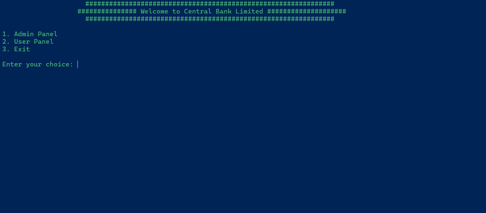
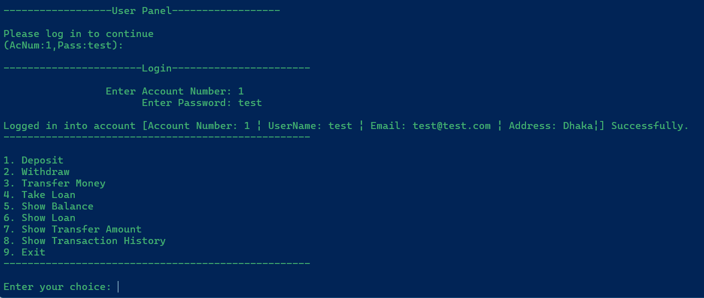
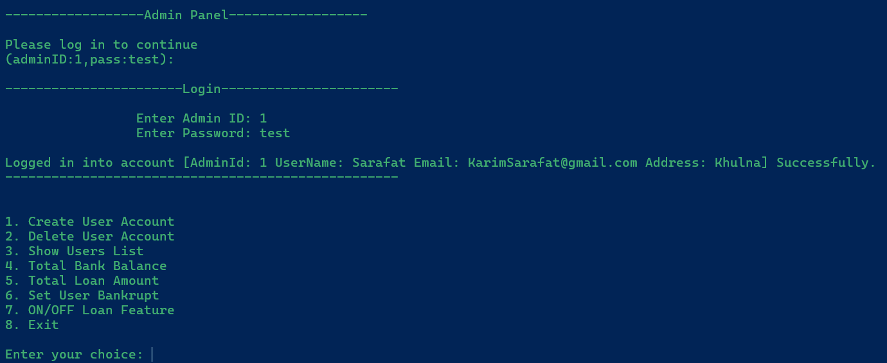

# **Bank Management System - Python OOP Project**

## **Table of Contents**
1. [Description](#description)
2. [Features](#features)
3. [Screenshots](#screenshots)
4. [Technologies Used](#technologies-used)
5. [Concept](#concept)
6. [Installation](#installation)
7. [Usage](#usage)
8. [Contribution](#contribution)
9. [Acknowledgments](#acknowledgments)
10. [Message](#message)
11. [Contact](#contact)
12. [Connect](#connect)


## **Description**

This project presents a fundamental bank management system operated via a Command Line Interface, leveraging Python programming and Object-Oriented Programming (OOP) concepts. It facilitates essential banking operations where users can create accounts, deposit money, withdraw money, transfer funds, and take loans. Administrators have additional privileges such as creating user accounts, deleting user accounts, and managing bank operations.


## **Features**
- **User Functionalities**:
  - User account creation and management
  - Deposit and withdrawal transactions
  - Transfer funds between accounts
  - Loan management
  - Transaction history
  - Bankrupt account management

- **Admin Functionalities:**
  - Create user accounts
  - Delete user accounts
  - View users list
  - View total bank balance
  - View total loan amount
  - Set user as bankrupt
  - Enable/disable loan feature

- User-friendly command-line interface (CLI)

## **Screenshots**





## **Technologies Used**
- **Python**

## Concept
- Object Oriented Programming

## **Installation**
1. *Clone the repository:*
   ```bash
   git clone https://github.com/Schr0Smi1ey/Bank-Management-System.git

   cd Bank-Management-System
2. *Run Project:*
   ```bash
   python Main.py
## **Usage**
- Launch the application by running the `Main.py` file.
- Follow the on-screen instructions to perform banking operations.

## **Contribution**
Contributions are welcome! If you'd like to contribute to the project, please follow these steps:

1. Fork the repository
2. Create a new branch (`git checkout -b feature/new-feature`)
3. Commit your changes (`git commit -m 'Add new feature'`)
4. Push to the branch (`git push origin feature/new-feature`)
5. Create a pull request

## **Acknowledgments**
- This project provided valuable insights into Python programming and Object-Oriented Programming (OOP) principles.
- Python's flexibility and OOP's modular approach significantly contributed to the project's development.

## **Message**
This project serves as a foundational exercise in object-oriented programming. I plan to continually enhance it with additional features and integrations.

## **Contact**
- 📫 How to reach me: Radiantremel444@gmail.com

## **Connect**
:handshake:  <br>


<a href="https://fb.com/radiant.remel.5" target="blank">
    
</a>
<a href="https://www.linkedin.com/in/sarafat-karim-0a91b7182">
  
</a>
<a href="https://medium.com/@Schro_smiley">
  
</a>
<a href="https://twitter.com/sarafat_karim">
  
</a> <br>
